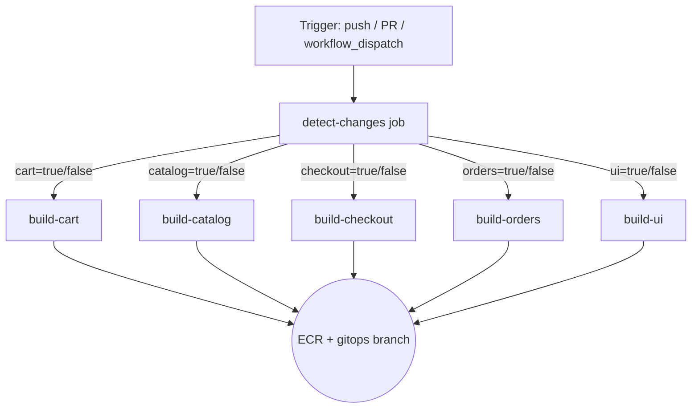

# Design Document — GitHub Actions CI/CD Pipeline

## Overview

This document describes the technical design for an automated CI/CD pipeline using GitHub Actions for the retail store sample application. The pipeline targets the `gitops` branch and implements a detect-build-push-update flow: it detects which of the five microservices (`cart`, `catalog`, `checkout`, `orders`, `ui`) have changed in a given commit or pull request, builds Docker images only for the changed services, pushes them to Amazon ECR, and writes the new image coordinates back into each service's Helm chart `values.yaml` so that ArgoCD can reconcile the updated state.

The pipeline is defined as a single workflow file at `.github/workflows/cicd.yml`. It consists of two logical tiers:

1. A `detect-changes` job that runs first and emits per-service boolean flags as job outputs.
2. Five independent per-service jobs (`build-cart`, `build-catalog`, `build-checkout`, `build-orders`, `build-ui`) that run in parallel and are conditioned on those flags.

The design deliberately avoids a fan-out matrix strategy in favor of individually named jobs so that each service appears as a distinct, named entry in the GitHub Actions UI (Requirement 7.3).

---

## Architecture

### Workflow Trigger

```yaml
on:
  push:
    branches: [gitops]
  pull_request:
    branches: [gitops]
  workflow_dispatch:
```

The `workflow_dispatch` event enables manual runs. When triggered manually, all five service flags are forced to `true` (Requirement 1.6, 8.5).

### Two-Tier Job Structure



Each `build-{service}` job carries a `needs: detect-changes` dependency solely to consume the flag outputs. There are no `needs:` relationships between the five build jobs themselves, so they run concurrently (Requirement 7.1).

### End-to-End Step Sequence per Build Job

```
1. Checkout repository
2. Configure AWS credentials (aws-actions/configure-aws-credentials)
3. Login to ECR (aws-actions/amazon-ecr-login)
4. Ensure ECR repository exists (AWS CLI idempotent create)
5. Docker build
6. Docker tag
7. Docker push (with retry)
8. Update values.yaml (sed)
9. Commit and push [skip ci]
```

---

## Components and Interfaces

### detect-changes Job

**Action used:** [`dorny/paths-filter@v3`](https://github.com/dorny/paths-filter)

`dorny/paths-filter` reads the diff between the base and head of the triggering event and emits string outputs (`'true'`/`'false'`) for each named filter. The filter configuration in the workflow YAML maps each service name to its source path glob:

```yaml
- uses: dorny/paths-filter@v3
  id: filter
  with:
    filters: |
      cart:
        - 'src/cart/**'
      catalog:
        - 'src/catalog/**'
      checkout:
        - 'src/checkout/**'
      orders:
        - 'src/orders/**'
      ui:
        - 'src/ui/**'
```

The outputs `steps.filter.outputs.cart`, `steps.filter.outputs.catalog`, etc. are then propagated as job outputs so downstream jobs can read them via `needs.detect-changes.outputs.<service>`.

**workflow_dispatch override:** When the trigger is `workflow_dispatch`, paths-filter has no diff to evaluate (there is no base/head comparison for a manual trigger). The job uses a conditional to explicitly set all flags to `'true'` in this case:

```yaml
- name: Override flags for workflow_dispatch
  if: github.event_name == 'workflow_dispatch'
  run: echo "All services forced to true for manual dispatch"
```

The job outputs are wired with a conditional expression:

```yaml
outputs:
  cart: ${{ github.event_name == 'workflow_dispatch' && 'true' || steps.filter.outputs.cart }}
  catalog: ${{ github.event_name == 'workflow_dispatch' && 'true' || steps.filter.outputs.catalog }}
  # ... etc
```

### AWS Credentials Configuration

**Action:** [`aws-actions/configure-aws-credentials@v4`](https://github.com/aws-actions/configure-aws-credentials)

Each build job configures credentials at its start before any ECR operation:

```yaml
- uses: aws-actions/configure-aws-credentials@v4
  with:
    aws-access-key-id: ${{ secrets.AWS_ACCESS_KEY_ID }}
    aws-secret-access-key: ${{ secrets.AWS_SECRET_ACCESS_KEY }}
    aws-region: ${{ secrets.AWS_REGION }}
```

The ECR registry URL is derived inline from secrets:

```
${{ secrets.AWS_ACCOUNT_ID }}.dkr.ecr.${{ secrets.AWS_REGION }}.amazonaws.com
```

If `configure-aws-credentials` fails (missing or invalid secrets), the GitHub Actions step failure propagates immediately and all subsequent steps in the job are skipped (Requirement 2.3, 2.6).

### ECR Login

**Action:** [`aws-actions/amazon-ecr-login@v2`](https://github.com/aws-actions/amazon-ecr-login)

```yaml
- uses: aws-actions/amazon-ecr-login@v2
  id: ecr-login
```

This action runs `aws ecr get-login-password | docker login` internally. The output `steps.ecr-login.outputs.registry` provides the registry hostname, which can be reused in subsequent steps. If ECR login fails the job halts (Requirement 2.5).

### ECR Repository Auto-Creation

The pipeline uses an idempotent AWS CLI call: `describe-repositories` first, then `create-repository` only if the describe call fails with `RepositoryNotFoundException`. This is done with `|| true` suppression on the describe call and a conditional create:

```bash
aws ecr describe-repositories \
  --repository-names "retail-store-${SERVICE}" \
  --region "${AWS_REGION}" 2>/dev/null \
|| aws ecr create-repository \
  --repository-name "retail-store-${SERVICE}" \
  --region "${AWS_REGION}" \
  --image-tag-mutability MUTABLE \
  --no-image-scanning-configuration
```

If the `create-repository` call itself fails (permissions error, network error, etc.) the step exits non-zero, the job fails, and an error message with the repository name, region, and exit code is emitted (Requirement 3.4).

### Docker Build and Push

**Build step:**

```bash
docker build \
  -f src/${SERVICE}/Dockerfile \
  -t ${ECR_REGISTRY}/retail-store-${SERVICE}:${IMAGE_TAG} \
  src/${SERVICE}/
```

`IMAGE_TAG` is extracted from the commit SHA:

```bash
IMAGE_TAG="${{ github.sha }}" | cut -c1-7
# Expressed in the workflow as:
IMAGE_TAG="${GITHUB_SHA::7}"
```

**Push step with retry:**

```bash
for i in 1 2 3; do
  docker push ${ECR_REGISTRY}/retail-store-${SERVICE}:${IMAGE_TAG} && break
  echo "Push attempt $i failed, retrying in 10s..."
  sleep 10
done
```

If all three attempts fail, the step exits non-zero, fails the job, and reports the ECR repository and exit code (Requirement 4.5).

### Helm values.yaml Update

The update uses `sed` to target only the top-level `image:` block lines. The challenge is that each service's `values.yaml` contains nested `image:` blocks under infrastructure sidecars (e.g., `dynamodb.image`, `mysql.image`, `redis.image`). A naive `sed` would corrupt those nested entries.

**Strategy:** Use `sed` with a line-range approach, anchoring on the top-level `image:` key (zero-indented) and modifying only the `repository:` and `tag:` lines that immediately follow at one level of indentation, before any other zero-indented key is encountered. Alternatively, use `yq` for safer YAML manipulation:

```bash
# Using yq (preferred for correctness):
yq e '.image.repository = "'${ECR_REGISTRY}/retail-store-${SERVICE}'"' -i src/${SERVICE}/chart/values.yaml
yq e '.image.tag = "'${IMAGE_TAG}'"' -i src/${SERVICE}/chart/values.yaml
```

`yq` operates at the YAML semantic level, so it modifies `.image.repository` and `.image.tag` (top-level keys) without touching `.dynamodb.image`, `.mysql.image`, or `.redis.image` (Requirement 5.3).

**Fallback with sed** (if `yq` is unavailable on the runner):

```bash
# Update only lines matching "  repository:" and "  tag:" that appear
# within the top-level image block (between the ^image: line and the
# next zero-indented key). Using awk for safe scoped replacement.
awk '
  /^image:/ { in_image=1 }
  /^[a-z]/ && !/^image:/ { in_image=0 }
  in_image && /^  repository:/ { $0="  repository: '"${REPO}"'" }
  in_image && /^  tag:/ { $0="  tag: \"'"${TAG}"'\"" }
  { print }
' src/${SERVICE}/chart/values.yaml > /tmp/values_updated.yaml \
  && mv /tmp/values_updated.yaml src/${SERVICE}/chart/values.yaml
```

The `yq` approach is preferred and is the primary implementation.

### Git Commit and Push

After updating `values.yaml`, the pipeline commits and pushes the change back to the `gitops` branch:

```bash
git config user.name "github-actions[bot]"
git config user.email "github-actions[bot]@users.noreply.github.com"

git add src/${SERVICE}/chart/values.yaml

# Only commit if there are staged changes (idempotency check)
if git diff --staged --quiet; then
  echo "No changes to commit for ${SERVICE}"
else
  git commit -m "Update ${SERVICE} image to ${IMAGE_TAG} [skip ci]"
  git push origin gitops
fi
```

The `GITHUB_TOKEN` is used for the push. It is injected into the remote URL:

```bash
git remote set-url origin https://x-access-token:${{ secrets.GITHUB_TOKEN }}@github.com/${{ github.repository }}
```

The workflow's permissions block scopes the token to `contents: write` only (Requirement 6.3):

```yaml
permissions:
  contents: write
```

The `[skip ci]` token in the commit message prevents the push from re-triggering the pipeline (Requirement 6.2). If the git push fails, the job fails immediately with no retry (Requirement 6.4).

---

## Data Models

### Job Outputs from detect-changes

| Output key | Type | Values |
|------------|------|--------|
| `cart` | string | `'true'` or `'false'` |
| `catalog` | string | `'true'` or `'false'` |
| `checkout` | string | `'true'` or `'false'` |
| `orders` | string | `'true'` or `'false'` |
| `ui` | string | `'true'` or `'false'` |

GitHub Actions job outputs are always strings, so downstream jobs evaluate them as `== 'true'` in `if:` conditions.

### Build Job Inputs (implicit via `needs`)

| Variable | Source | Example |
|----------|--------|---------|
| `ECR_REGISTRY` | `steps.ecr-login.outputs.registry` | `123456789012.dkr.ecr.us-east-1.amazonaws.com` |
| `IMAGE_TAG` | `${GITHUB_SHA::7}` | `a1b2c3d` |
| `SERVICE` | hardcoded per job | `cart` |
| `ECR_REPO` | derived: `retail-store-${SERVICE}` | `retail-store-cart` |

### Helm values.yaml Image Block (per-service)

Before update:
```yaml
image:
  repository: public.ecr.aws/aws-containers/retail-store-sample-cart
  pullPolicy: Always
  tag: "1.2.2"
```

After update:
```yaml
image:
  repository: 123456789012.dkr.ecr.us-east-1.amazonaws.com/retail-store-cart
  pullPolicy: Always   # preserved unchanged
  tag: "a1b2c3d"
```

Nested infrastructure images (unchanged by the update):
```yaml
dynamodb:
  image:
    repository: public.ecr.aws/aws-dynamodb-local/aws-dynamodb-local
    tag: "1.25.1"
mysql:
  image:
    repository: public.ecr.aws/docker/library/mysql
    tag: "8.0"
redis:
  image:
    repository: public.ecr.aws/docker/library/redis
    tag: "6.0-alpine"
```

### Commit Message Format

```
Update {service} image to {IMAGE_TAG} [skip ci]
```

Example: `Update cart image to a1b2c3d [skip ci]`

The `[skip ci]` token must be a standalone token (separated by spaces from surrounding words) so GitHub Actions recognizes it (Requirement 6.2).

### GitHub Actions Secrets

| Secret name | Usage |
|-------------|-------|
| `AWS_ACCESS_KEY_ID` | IAM credentials for ECR operations |
| `AWS_SECRET_ACCESS_KEY` | IAM credentials for ECR operations |
| `AWS_REGION` | Target AWS region (e.g., `us-east-1`) |
| `AWS_ACCOUNT_ID` | Used to construct ECR registry URL |
| `GITHUB_TOKEN` | Built-in; used for git push with `contents: write` |

---

## Correctness Properties

*A property is a characteristic or behavior that should hold true across all valid executions of a system — essentially, a formal statement about what the system should do. Properties serve as the bridge between human-readable specifications and machine-verifiable correctness guarantees.*

The majority of this pipeline is declarative GitHub Actions YAML (trigger configuration, job ordering, action invocations) and AWS infrastructure operations. These are not suitable for property-based testing — they are configuration smoke tests and integration tests. However, three areas of the pipeline involve logic that operates on data and can be tested as universal properties:

1. **IMAGE_TAG extraction** — a string operation on the commit SHA.
2. **Helm values.yaml top-level image update** — a text/YAML transformation that must correctly update `image.repository` and `image.tag`.
3. **Nested image preservation** — the same transformation must not corrupt nested infrastructure image blocks.
4. **Commit message format** — a string template that must include `[skip ci]` as a standalone token.

### Property 1: IMAGE_TAG is a 7-character SHA prefix

*For any* commit SHA string of at least 7 characters, the `IMAGE_TAG` derived from it shall be exactly 7 characters long and shall equal the first 7 characters of the original SHA.

**Validates: Requirements 4.2**

### Property 2: Top-level image values are updated correctly

*For any* `values.yaml` content that contains a top-level `image:` block with `repository:` and `tag:` sub-keys, applying the image update operation with a given ECR repository URL and image tag shall result in the top-level `image.repository` being set to the new repository URL and the top-level `image.tag` being set to the new tag value.

**Validates: Requirements 5.1, 5.2**

### Property 3: Nested infrastructure image values are preserved

*For any* `values.yaml` content that contains both a top-level `image:` block and one or more nested image blocks (e.g., `dynamodb.image`, `mysql.image`, `redis.image`), applying the top-level image update operation shall leave every nested `image.repository` and `image.tag` value unchanged from their original values.

**Validates: Requirements 5.3**

### Property 4: Commit message contains [skip ci] as a standalone token

*For any* service name and image tag string, the commit message generated by the pipeline shall contain the exact string `[skip ci]` as a standalone space-delimited token (not embedded within another word), and shall match the format `Update {service} image to {tag} [skip ci]`.

**Validates: Requirements 5.4, 6.2**

---

## Error Handling

| Failure point | Behavior | Requirement |
|---------------|----------|-------------|
| Missing AWS secret | Job fails immediately with message identifying which secret is absent | 2.6 |
| AWS credential configuration fails | Job fails, subsequent steps skipped | 2.3 |
| ECR login fails | Job fails immediately, no docker push attempted | 2.5 |
| ECR repo check/create fails | Job fails with repo name, region, and error cause | 3.4 |
| Dockerfile not found | Job fails immediately with missing path reported | 4.6 |
| Docker build fails | Job fails with service name and exit code; push skipped | 4.4 |
| Docker push fails (all 3 retries) | Job fails with ECR repo and exit code; values.yaml update skipped | 4.5 |
| values.yaml absent/unreadable | Job fails immediately with file path reported | 5.6 |
| Git push fails | Job fails immediately, no retry, error includes branch name and cause | 5.7, 6.4 |
| One build job fails | Other parallel build jobs continue unaffected | 7.2 |

**Retry policy:** Only `docker push` has a retry (3 attempts, 10-second intervals). All other failure modes are immediate fail-fast. Git push specifically must NOT be retried (Requirement 6.4) to avoid push conflicts from concurrent jobs.

**Idempotency:** If `values.yaml` already contains the correct `image.repository` and `image.tag`, `git diff --staged --quiet` will be true and no commit is made (Requirement 5.5).

---

## Testing Strategy

### PBT Applicability Assessment

The pipeline is primarily GitHub Actions YAML configuration and AWS CLI invocations. The vast majority of acceptance criteria describe workflow configuration (trigger rules, action usage, job ordering, permissions) and external service interactions (ECR, Docker, git). These are SMOKE and INTEGRATION test categories, not property-based test candidates.

Four properties were identified as appropriate for property-based testing: IMAGE_TAG extraction, YAML update correctness, nested value preservation, and commit message format. These are pure string/text transformation functions that can be extracted and tested independently of the GitHub Actions runtime.

**Property-based testing library:** [`fast-check`](https://fast-check.dev/) (JavaScript/TypeScript), which works well for testing shell script logic extracted into Node.js helper modules or for directly testing a `yq`-equivalent JavaScript implementation.

Alternatively, the `yq` command-line tool can be tested via shell script harnesses with generated test fixtures.

### Unit / Example Tests

These cover specific scenarios not suited for property generation:

- `workflow_dispatch` trigger sets all five flags to `true` (inspect workflow YAML / dry-run)
- ECR URL format: `{ACCOUNT}.dkr.ecr.{REGION}.amazonaws.com` given known account/region values
- Idempotent values.yaml update: running the update twice on already-updated content produces no git diff
- Missing Dockerfile: build step reports correct error path (e.g., `src/cart/Dockerfile`)
- Empty change set: detect-changes job completes with all flags false, no build jobs execute

### Property Tests

Each property test must run a minimum of 100 iterations to cover the input space.

**Property 1: IMAGE_TAG is a 7-character SHA prefix**
- Generator: arbitrary hex strings of length ≥ 7 (simulating commit SHAs)
- Assertion: `extractImageTag(sha).length === 7 && sha.startsWith(extractImageTag(sha))`
- Tag: `Feature: github-actions-cicd, Property 1: IMAGE_TAG is a 7-character SHA prefix`

**Property 2: Top-level image values are updated correctly**
- Generator: arbitrary values.yaml content with a top-level `image:` block; arbitrary ECR repository URLs and image tags
- Assertion: after `applyImageUpdate(yaml, repo, tag)`, `parsedYaml.image.repository === repo` and `parsedYaml.image.tag === tag`
- Tag: `Feature: github-actions-cicd, Property 2: Top-level image values are updated correctly`

**Property 3: Nested infrastructure image values are preserved**
- Generator: values.yaml content with a top-level `image:` block AND one or more nested image blocks under arbitrary parent keys; arbitrary new repository and tag values
- Assertion: after `applyImageUpdate(yaml, repo, tag)`, all nested `*.image.repository` and `*.image.tag` values are identical to their pre-update values
- Tag: `Feature: github-actions-cicd, Property 3: Nested infrastructure image values are preserved`

**Property 4: Commit message contains [skip ci] as a standalone token**
- Generator: arbitrary service names (alphabetic strings) and image tag strings (7-char hex)
- Assertion: `buildCommitMessage(service, tag)` contains `[skip ci]` as a space-delimited token and matches the regex `/^Update \S+ image to \S+ \[skip ci\]$/`
- Tag: `Feature: github-actions-cicd, Property 4: Commit message contains [skip ci] as a standalone token`

### Integration Tests

These require a real or mocked AWS environment:

- ECR repository auto-creation: verify `retail-store-{service}` is created when absent
- ECR repository idempotency: verify no error when repository already exists
- Docker push: verify image appears in ECR after successful push (1–2 examples)
- Git push: verify `values.yaml` commit appears on `gitops` branch after successful pipeline run

### Smoke Tests (Workflow YAML Review)

Performed via static analysis of `.github/workflows/cicd.yml`:

- Path filters for all five services are correctly specified under `src/{service}/**`
- `workflow_dispatch` trigger is present with no required inputs
- `on.push.branches` and `on.pull_request.branches` are both scoped to `[gitops]`
- All five build jobs have `needs: detect-changes` and correct `if:` condition
- No `needs:` relationships exist between build jobs (confirming parallelism)
- `permissions: contents: write` is set at the workflow or job level
- Git config sets `user.name` and `user.email` to the bot identity
- `[skip ci]` token is present in the commit message template
